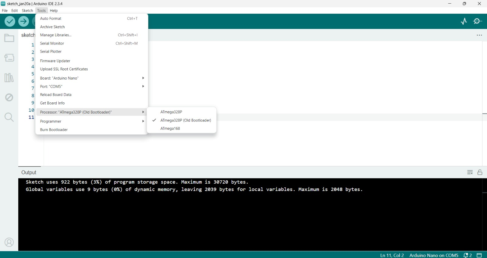
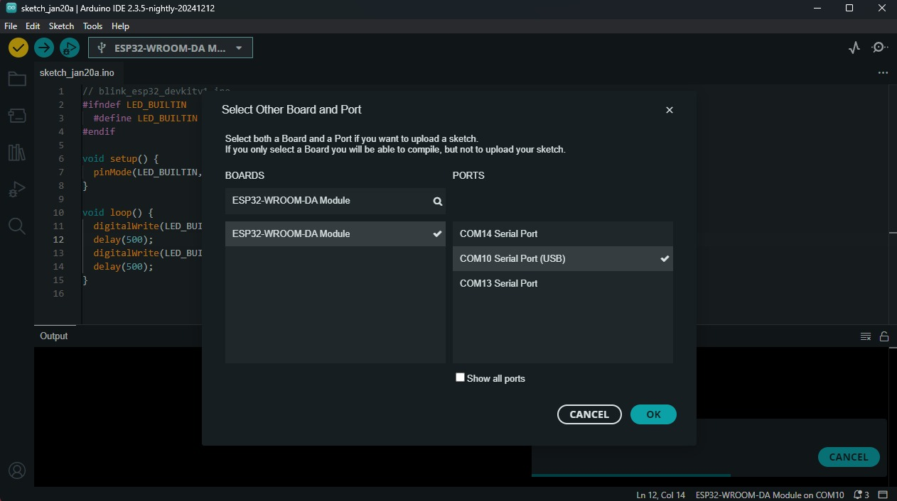
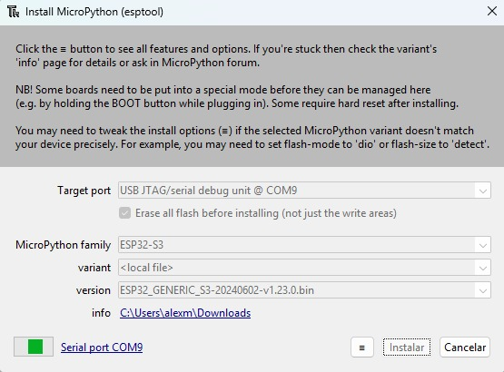
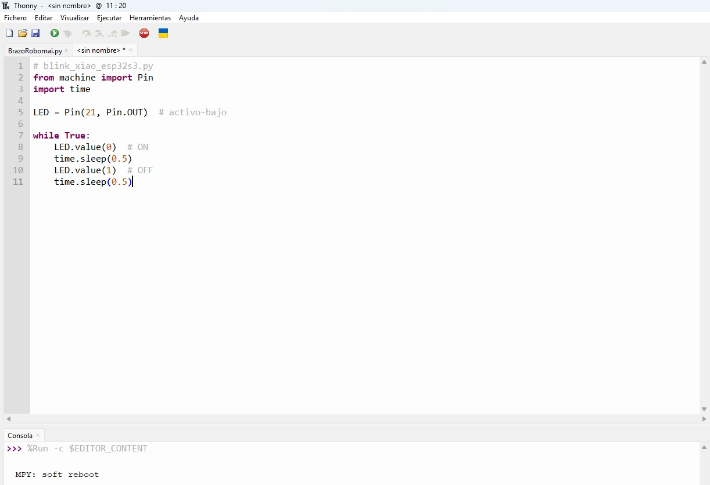

# Práctica 1

  En la presente práctica se realizó la implementación del programa básico Blink en distintas placas de desarrollo con el objetivo de verificar su correcto funcionamiento, así como comprobar la comunicación entre el entorno de desarrollo y el microcontrolador. El programa Blink consiste en el encendido y apagado periódico de un LED, lo cual permite validar de manera sencilla las salidas digitales, la carga del código y la correcta configuración de la placa utilizada.

  Para el desarrollo de la práctica se emplearon diversas plataformas de control, entre las que se incluyen Arduino Uno y Arduino Nano (ATmega328), ESP32 DevKit V1 (ESP32-WROOM-32), XIAO ESP32S3 Sense y XIAO RP2040. Cada una de estas placas presenta características particulares en cuanto a arquitectura, capacidad de procesamiento y método de comunicación, lo que permitió comparar su comportamiento y proceso de configuración dentro del entorno de programación.

---

## Blink con Arduino Uno

- **Conexión**  
  La comunicación entre la computadora y la placa Arduino Uno/Nano se realizó mediante comunicación serial por USB. Este tipo de comunicación permite la transferencia de datos y programas

  Para establecer correctamente la comunicación entre la computadora y la placa Arduino, se realizaron los siguientes pasos dentro del Arduino IDE:

  Se seleccionó el modelo de la placa utilizada (Arduino Uno o Arduino Nano) desde el menú Herramientas → Placa.

  Se identificó y seleccionó el puerto de comunicación correspondiente desde Herramientas → Puerto, el cual aparece como un puerto serial (por ejemplo, COM8).

  Una vez configurados la placa y el puerto, el programa fue compilado y cargado correctamente en el microcontrolador mediante el botón de carga del entorno de desarrollo.

  

- **Código** 
Dentro de la función setup(), se configuró el pin del LED como salida mediante la instrucción pinMode. En la función loop(), se implementó la lógica de encendido y apagado del LED utilizando las instrucciones digitalWrite, acompañadas de retardos temporales de 500 milisegundos mediante la función delay()

  

- **Video funcionando**  
    <video controls width="640">
      <source src="{{ '/assets/img/arduino.mp4' | relative_url }}" type="video/mp4">
      Tu navegador no soporta video HTML5.
    </video>

---

## Arduino nano

  - **Conexión** 

    Al igual que en el Arduino Uno, la comunicación USB es convertida internamente a comunicación serial UART mediante un convertidor USB–Serial integrado en la placa Arduino Nano

    Para realizar la programación de la placa Arduino Nano, se llevaron a cabo los siguientes pasos en el entorno de desarrollo Arduino IDE:

    Se seleccionó la placa Arduino Nano desde el menú Herramientas → Placa.

    Se eligió el puerto serial correspondiente desde Herramientas → Puerto, identificado como un puerto USB (por ejemplo, COM5).

    Una vez configurados la placa y el puerto, se procedió a compilar y cargar el programa en el microcontrolador.

    

    Durante la programación del Arduino Nano, fue necesario ajustar la configuración del procesador debido a que se utilizó una versión antigua de la placa. Para ello, en el Arduino IDE se seleccionó la opción ATmega328P (Old Bootloader) desde el menú Herramientas → Procesador.

    

  - **Código** 

    El programa desarrollado tiene como finalidad controlar el encendido y apagado del LED integrado en la placa Arduino Nano, identificado como LED_BUILTIN.

    En la función setup(), se configuró el pin del LED como salida digital mediante la instrucción pinMode. Posteriormente, en la función loop(), se implementó una secuencia cíclica en la cual el LED se enciende y apaga utilizando la instrucción digitalWrite, incorporando retardos de tiempo mediante la función delay() para controlar la velocidad del parpadeo.

  

- **Video funcionando**  
    <video controls width="640">
      <source src="{{ '/assets/img/nano.mp4' | relative_url }}" type="video/mp4">
      Tu navegador no soporta video HTML5.
    </video>

---

## ESP32‑WROOM‑32

  - **Conexión 3**

    Para la correcta programación de la placa ESP32-WROOM-32, se realizaron los siguientes pasos en el Arduino IDE

    Se seleccionó la placa ESP32-WROOM-DA Module desde el menú Herramientas → Placa, correspondiente al módulo utilizado en la práctica.

    Se eligió el puerto de comunicación serial asignado a la placa desde Herramientas → Puerto, identificado como un puerto USB (por ejemplo, COM10).

    Una vez configurados la placa y el puerto, se procedió a compilar y cargar el programa en el microcontrolador.

    

  - **Código** 

  El programa desarrollado tiene como objetivo realizar el parpadeo del LED integrado en la placa ESP32-WROOM-32, el cual se encuentra conectado al pin digital 2.

  Debido a que en algunas configuraciones del ESP32 el pin del LED integrado no se encuentra definido por defecto, se utilizó una directiva de preprocesador (#ifdef) para definir el pin correspondiente (LED_BUILTIN) únicamente en caso de que no estuviera previamente declarado.

  En la función setup(), el pin del LED se configuró como salida digital mediante la instrucción pinMode. Posteriormente, en la función loop(), se implementó una secuencia cíclica en la que el LED se enciende y apaga de manera alternada utilizando la instrucción digitalWrite, incorporando retardos de 500 milisegundos con la función delay() para controlar la frecuencia del parpadeo

  

  - **Video funcionando**  

    <video controls width="640">
      <source src="{{ '/assets/img/video_wroom.mp4' | relative_url }}" type="video/mp4">
      Tu navegador no soporta video HTML5.
    </video>

---

## XIAO ESP32S3 Sense

  - **Conexión** 

    Para la programación de la placa se utilizó el entorno Thonny, configurado para trabajar con MicroPython. Dentro de las opciones del intérprete se seleccionó MicroPython (ESP32) y se habilitó la detección automática del puerto serial correspondiente a la placa.

    Debido a las características del dispositivo, fue necesario instalar el firmware de MicroPython para ESP32-S3 utilizando la herramienta integrada en Thonny. Durante este proceso se seleccionó el puerto serial asignado a la placa y la versión correspondiente del firmware, permitiendo que el dispositivo quedara listo para ejecutar scripts en MicroPython.

    

    

  - **Código** 

    El programa fue desarrollado en MicroPython y tiene como objetivo realizar el parpadeo del LED integrado en la placa XIAO ESP32S3 Sense, utilizando programación directa sobre el microcontrolador.

    En el código se importan las bibliotecas machine y time, las cuales permiten el control de los pines digitales y la gestión de retardos de tiempo, respectivamente. El pin correspondiente al LED se configuró como salida digital mediante la instrucción Pin.

    Debido a las características de la placa, el LED opera en configuración activo-bajo, por lo que un valor lógico bajo (0) enciende el LED, mientras que un valor lógico alto (1) lo apaga. La estructura while True permite que el parpadeo del LED se ejecute de manera continua, incorporando retardos de 0.5 segundos para controlar la frecuencia de encendido y apagado.

    

- **Video funcionando**  
    <video controls width="640">
      <source src="{{ '/assets/img/nano.mp4' | relative_url }}" type="video/mp4">
      Tu navegador no soporta video HTML5.
    </video>

---

## Siguiente sección

[Software (GRBL + OpenBuilds)](software.md)
