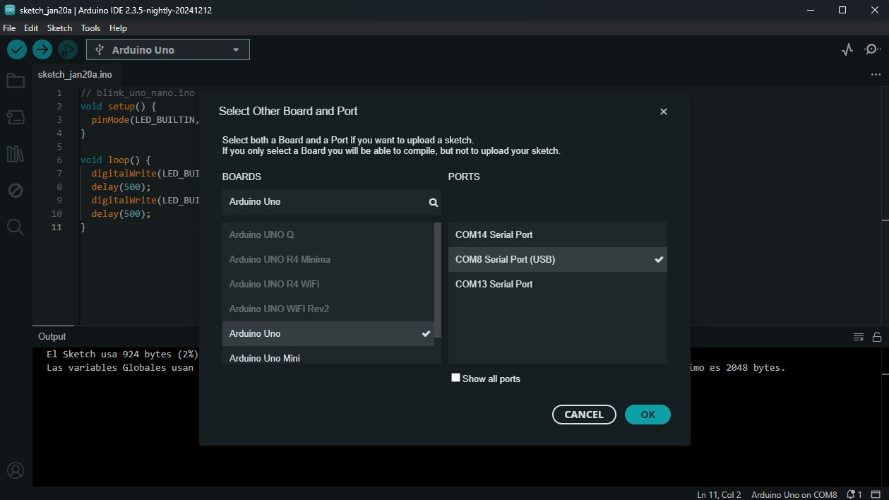
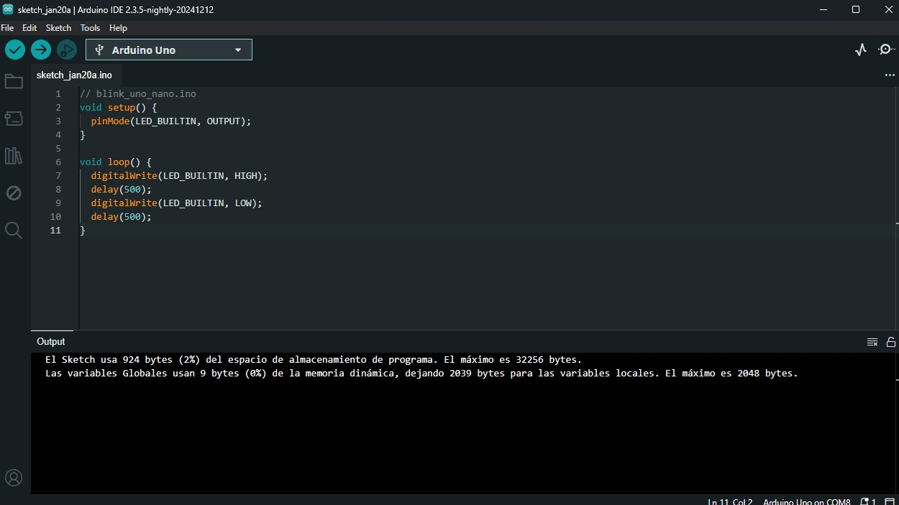

# Práctica 1

En esta sección explicaremos lo que se realizo en nuestra primera práctica.

- Arduino UNO  
- CNC Shield V3  
- Drivers A4988 (o similares)  
- Motores NEMA 17  
- Fuente DC de 12–24 V  
- Finales de carrera (opcional, pero recomendable)

> ⚠️ **Seguridad:** antes de conectar o desconectar motores, drivers o fuente de alimentación, asegúrate de que todo está apagado y la fuente desconectada.

---

## Blink con Arduino Uno / Nano

- **Objetivo**  
  Implementar un programa básico en la plataforma Arduino que permita el encendido y apagado periódico del LED integrado en la placa, con el fin de verificar la correcta comunicación entre el entorno de desarrollo (Arduino IDE) y la placa de control

  

- **Conexión**  
  La comunicación entre la computadora y la placa Arduino Uno/Nano se realizó mediante comunicación serial por USB. Este tipo de comunicación permite la transferencia de datos y programas

  Para establecer correctamente la comunicación entre la computadora y la placa Arduino, se realizaron los siguientes pasos dentro del Arduino IDE:

  Se seleccionó el modelo de la placa utilizada (Arduino Uno o Arduino Nano) desde el menú Herramientas → Placa.

  Se identificó y seleccionó el puerto de comunicación correspondiente desde Herramientas → Puerto, el cual aparece como un puerto serial (por ejemplo, COM8).

  Una vez configurados la placa y el puerto, el programa fue compilado y cargado correctamente en el microcontrolador mediante el botón de carga del entorno de desarrollo.

  

- **Codigo** 
Dentro de la función setup(), se configuró el pin del LED como salida mediante la instrucción pinMode. En la función loop(), se implementó la lógica de encendido y apagado del LED utilizando las instrucciones digitalWrite, acompañadas de retardos temporales de 500 milisegundos mediante la función delay()


  

- **Video funcionando**  
    <video controls width="640">
      <source src="{{ '/assets/img/arduino.mp4' | relative_url }}" type="video/mp4">
      Tu navegador no soporta video HTML5.
    </video>

  

- **Fuente de 12–24 V** para los motores  
  Alimenta los drivers y, por lo tanto, los motores. El Arduino se alimenta por USB.

  

- **Finales de carrera** (opcional)  
  Interruptores que permiten detectar los límites físicos para homing y protección.

  

---

## 1. Montaje del CNC Shield y drivers

1. Inserta el **CNC Shield V3** sobre el Arduino UNO alineando todos los pines.  
   Debe entrar suave, sin forzar.

2. Coloca los **drivers A4988** en los zócalos de X, Y, Z:
   - Verifica la **orientación correcta** (pines EN, STEP, DIR, VDD, GND deben coincidir con la serigrafía de la shield).
   - Normalmente el **potenciómetro** del driver queda orientado hacia el conector de alimentación de la shield.

   

3. Debajo de cada driver (X, Y, Z) coloca **tres jumpers** de microstepping:
   - MS1, MS2, MS3 → colocados → configurados para **1/16 de paso** (en A4988).
   - Esto hace que los movimientos sean más suaves y precisos, a costa de requerir más pasos por milímetro.
   - **Nota:** Si no colocas los jumpers, el paso sera completo y la máquina avanzará más rápido **con el mismo G-code**, pero tendrás **menor resolución** y movimientos más bruscos.

   

> ⚠️ No insertes ni retires drivers A4988 con la fuente energizada. Siempre apaga y desconecta la alimentación antes de manipularlos.

---

## 2. Alimentación

- Usa una fuente DC con salida entre **12–24 V**, dependiendo de tus motores y drivers:
  - 12 V → más suave y seguro para empezar.
  - 24 V → mejor respuesta a altas velocidades (si drivers y motores lo soportan).

- Como guía práctica para la **corriente** de la fuente:

  > Corriente recomendada ≈ (número de motores) × (corriente por fase del motor) × 0.7–0.8  
  > Ejemplo: 3 motores de 1.5 A → fuente de al menos ~3–4 A (mejor 5 A).

- Conecta la fuente al borne de tornillo del CNC Shield:
  - `+` → positivo de la fuente.
  - `-` o `GND` → negativo de la fuente.

- El Arduino se alimenta por **USB** desde la computadora; la shield y los motores por la **fuente DC**:
  - Esto ayuda a separar el ruido de los motores de la lógica.

> ✅ **Recomendación:** usa cables adecuados para la corriente (por ejemplo, 18–20 AWG para 3–5 A) y aprieta bien los tornillos de la bornera.

> 🔎 **Verificación:** antes de conectar los motores, mide con un multímetro el voltaje en la bornera:
> - Polaridad correcta.
> - Voltaje dentro del rango esperado.


---

## 3. Conexión de motores

- Conecta cada motor NEMA 17 a su respectivo conector en la CNC Shield:
  - **Eje X** → Ejemplo: carro con banda dentada.
  - **Eje Y** → Ejemplo: mesa / base con husillo.
  - **Eje Z** → Ejemplo: mecanismo de cremallera, husillo o el eje vertical de tu herramienta.


### 3.1. Motores con conector estándar

Si estás usando motores NEMA con **conector estándar** (como los que suelen traer cable preensamblado):

- Normalmente basta con insertar el conector en el puerto correspondiente (X, Y, Z) de la shield.
- En muchos cables, el **cable rojo** queda en la parte superior del conector en la shield (pero esto puede variar según fabricante; revisa el datasheet si es posible).


### 3.2. Motores bipolares de 4 cables sin conector estándar

Si tus motores son bipolares de **4 cables sueltos**, primero debes identificar las **bobinas**:

1. Con un multímetro en modo continuidad o resistencia:
   - Encuentra qué pares de cables forman cada bobina (tendrán resistencia de unos pocos ohms).
   - Por ejemplo:
     - Bobina A → cables (rojo, azul).
     - Bobina B → cables (verde, negro).

2. Conecta las bobinas al driver (en el conector de la shield) en el siguiente orden de arriba a abajo:

   ```text
   A+   A−   B+   B−
   ```

3. Si al hacer un jog el motor **tiembla pero no gira**, probablemente los cables estén cruzados o las bobinas invertidas:
   - Cambia el orden de los cables (por ejemplo intercambiando A y B) hasta que el giro sea suave y continuo.

> ⚠️ No conectes ni desconectes los motores con la fuente encendida; puedes dañar tanto el driver como el motor.

---

## 4. Finales de carrera (opcional)

Los finales de carrera mejoran la seguridad y permiten hacer **homing** automático.

- Tipo recomendado: **microswitch mecánico con palanca**, usados en modo **NC** (normalmente cerrado).

  

- Conexión típica en el CNC Shield (conector X-, Y-, Z-):
  - `C` del switch → **GND (G)**.
  - `NC` del switch → **S (Signal)**.
  - Deja sin conectar el pin de **+5 V**.


Usar NC tiene varias ventajas:

- Si se corta un cable o se desconecta un switch, GRBL lo detecta como fallo.
- Reduce el riesgo de que la máquina se mueva fuera de límites sin detectar el error.

Más adelante, en GRBL, se activan:

- **Homing** (`$22=1`).
- **Límites duros** (`$21=1`) y/o **límites suaves** (`$20=1`).

Los detalles de configuración de homing y límites se describen en la sección de [Calibración](calibracion.md).

---

Con estos pasos, la parte de **hardware y conexiones físicas** queda lista para pasar a:

- Cargar GRBL en el Arduino.
- Configurar parámetros básicos.
- Empezar a probar movimientos desde el software.

---

## Siguiente sección

[Software (GRBL + OpenBuilds)](software.md)
